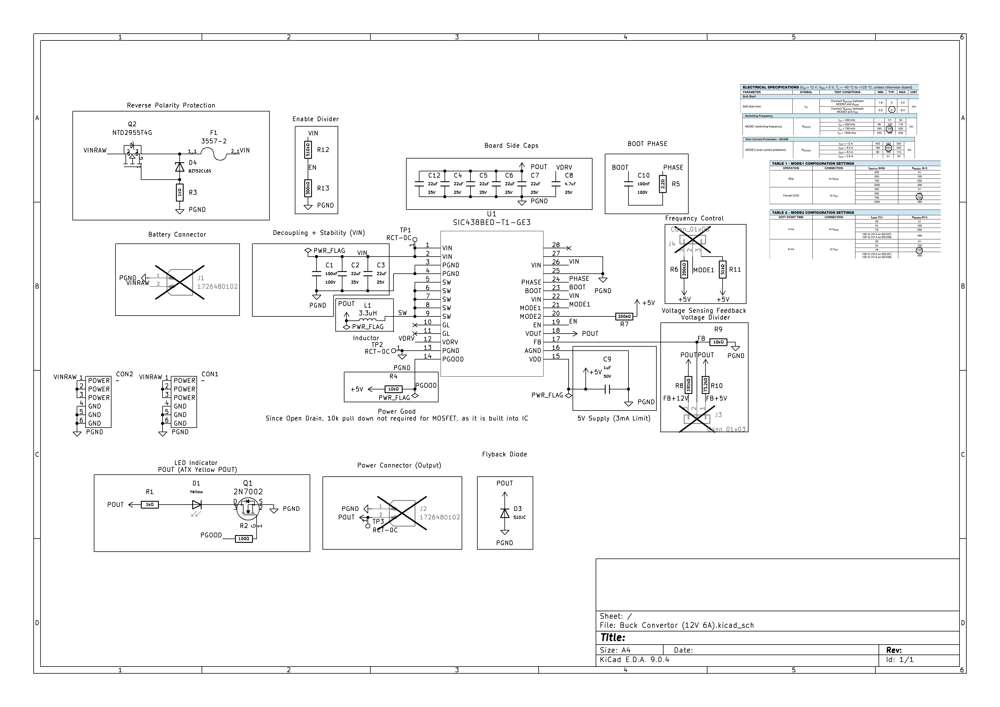

# About This Project
Hello everyone! This is a 12V/5V 8A adjustable buck converter I designed for a design team (96W Converter on a good day)
-1.png>)
This version of the board is untested, but the core functionality has (the converting) and it works pretty well
Every component on the board has a JLC# You just need to solder your own automotive blade fuse holder (3557-2) and Molex Mini fit Jrs (1726480102)
Approximate cost is ~40 CAD 2 boards assembled, 2 week shipping but could be smthn else idk
Its a lil cooked crimping those but you can do it with a basic JST crimper
There is an automotive blade fuse and a PFET for reverse polarity protection. Gold fingers for a slot card mount exist as well.
The core chip is the SIC438BED-T1-GE3, which is a monstorous package, but JLC can assemble it for you with no problems ish
# Tested functionality
12V 6A works at 300 kHz switching frequency (Vin of 13.2V) with a thermal rise of about ~25C
5V 6A works at 750kHz switching frequency (Vin of 13.2V) with a thermal rise of about ~10C
The tests were conducted using a electronic load and varying the current draw and determining temperature with thermocouple
If you have a higher voltage input, you can use the 750kHz switching frequency for the 12V rail. Do the max duty cycle calculations based on the SIC438BED-T1-GE3 datasheet
# Untested functionality
The reverse polarity protection was simulated using MultiSim, but due to a lack of moneys, the real life version is untested
The jumpers for swapping 12V with 5V and 750kHz and 300kHz are untested, but its just resistors so I'm not too worried about that
Technically, it operates at 8A (No OCP tripped when testing under load), and the chip is rated for 8A, I'm not sure about how tight the ripple is on the output nor thermal capabilities. Use at your own risk
# Things I (or someone else) need to clean up
All the footprint references for the JLC components are messed up because I switched to KiCAD 9
3D models for all the components need to be added eventually but lowkey too lazy to do that rn
Gonna do a better job with the test pads later lmao
Switch the PFET with a proper reverse polarity charge pump IC so high side NFET is usable. Less RDs on and less heat overall
Let me know if you want different connectors on this thing or you can just do it yourself files are on the page
# Schematic

# Final Remarks
I've tried doing this on a 2 layer board but JLC assembly does not support this IC on 2 layer. Switch to 2 layer at your own risk (They don't work 90% of the time). No issues with 4 layer so far
If anyone wanna donate me money so I can test this board DM me on Discord @javezki 
Love y'all